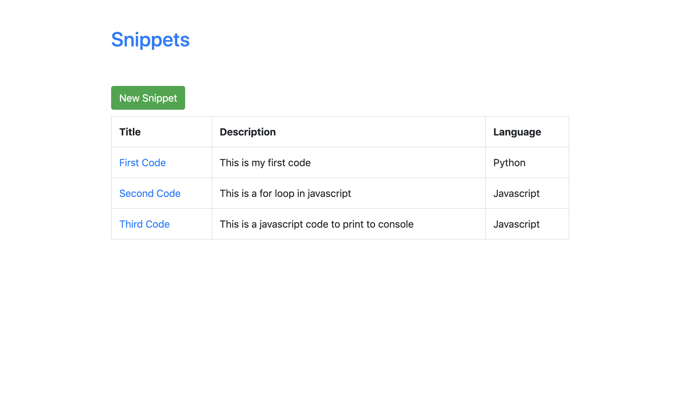
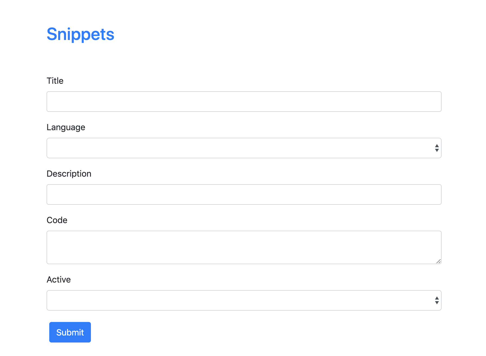
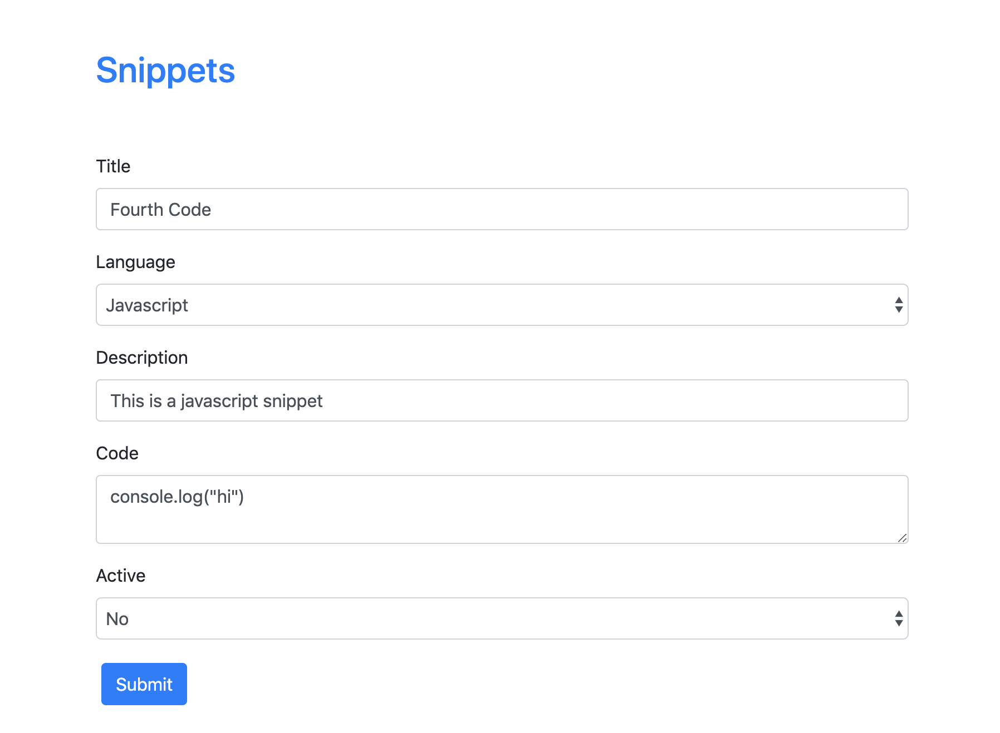

# Snippets App

## Running Instructions
### Configure database at
```
snippets/settings.py
```

### Migrate
```
python3 manage.py migrate
```

### Start server
```
python3 manage.py runserver
```

### Change directory to vue/ then execute
```
yarn install
```

### Run
```
yarn run serve
```





## What Features are missing?
* Authentication
* Notifications
* Unit tests
* Search
* Pagination

## What could you do better if you had more time?
* Fix lint problems
